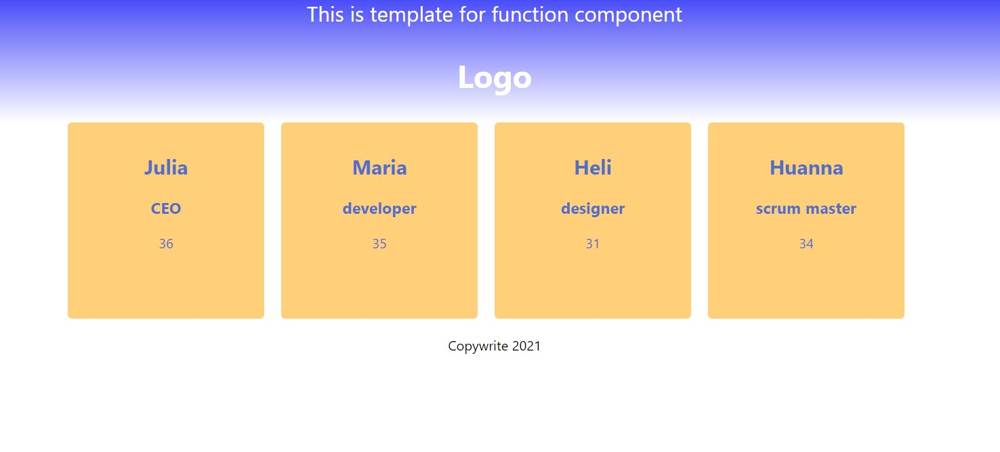

# Getting Started with Create React App and creating first App

Practice task - one of the first practice tasks in React to build a simple page in React with clean

<Header>
<Main>
<Footer>

## Technologies used

### Built with:

- HTML
- React
- CSS

### Authors and acknowledgment:

### Julia Matvi

GitHub @jualiasha

[LinkedIn](www.linkedin.com/in/jualiasha)
