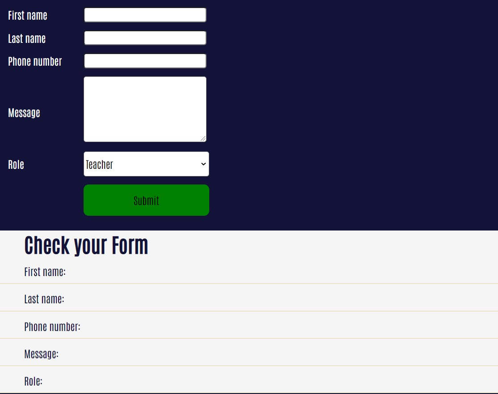

# School Project Cool Forms in React

Practice task - to make interactive forms.

## Technologies used

### Built with:

- HTML
- JS
- CSS
- Reactjs

### Authors and acknowledgment:

### Julia Matvi

GitHub @jualiasha

[LinkedIn](www.linkedin.com/in/jualiasha)
